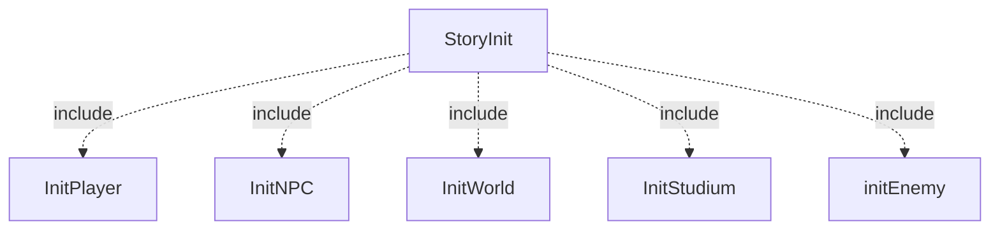

# Storygraph: 01_init.tw

Quelle: `src/01_init.tw`

- Passagen in dieser Datei: 6
- Verbindungen aus dieser Datei: 5
- Externe Ziele: 0
- Nicht gefundene Ziele: 0

```mermaid
flowchart TD
    classDef external fill:#302818,stroke:#c9a84c,color:#dfdcd6,stroke-dasharray: 5 5;
    classDef missing fill:#351b1b,stroke:#d98d7e,color:#f0d0c8,stroke-dasharray: 2 2;

    initEnemy["initEnemy"]
    InitNPC["InitNPC"]
    InitPlayer["InitPlayer"]
    InitStudium["InitStudium"]
    InitWorld["InitWorld"]
    StoryInit["StoryInit"]

    StoryInit -. include .-> InitPlayer
    StoryInit -. include .-> InitNPC
    StoryInit -. include .-> InitWorld
    StoryInit -. include .-> InitStudium
    StoryInit -. include .-> initEnemy
```

