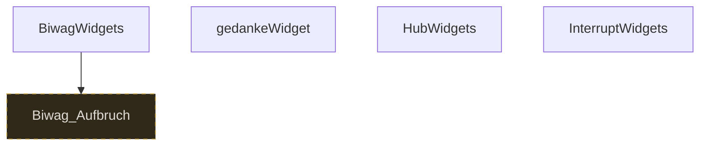

# Storygraph: 02_widgets.tw

Quelle: `src/02_widgets.tw`

- Passagen in dieser Datei: 4
- Verbindungen aus dieser Datei: 1
- Externe Ziele: 1
- Nicht gefundene Ziele: 0

## Externe Ziele

Diese Ziele liegen nicht in dieser Datei, werden aber von hier aus angesprungen.

- `Biwag_Aufbruch` → `src/08_passages_biwag.tw`

