# Storygraph: 05_passages_karla.tw

Quelle: `src/05_passages_karla.tw`

- Passagen in dieser Datei: 48
- Verbindungen aus dieser Datei: 35
- Externe Ziele: 2
- Nicht gefundene Ziele: 0

```mermaid
flowchart TD
    classDef external fill:#302818,stroke:#c9a84c,color:#dfdcd6,stroke-dasharray: 5 5;
    classDef missing fill:#351b1b,stroke:#d98d7e,color:#f0d0c8,stroke-dasharray: 2 2;

    Kap1_Tagesstart["Kap1_Tagesstart"]
    Karla_Geschenk["Karla_Geschenk"]
    Karla_Geschenk_Reaktion["Karla_Geschenk_Reaktion"]
    Karla_Paar_Moment["Karla_Paar_Moment"]
    Karla_Romanze_Moment["Karla_Romanze_Moment"]
    karla_S_Verhaftung["karla_S_Verhaftung"]
    karla_S1["karla_S1"]
    karla_S1_abwinken["karla_S1_abwinken"]
    karla_S1_annehmen["karla_S1_annehmen"]
    karla_S10["karla_S10"]
    karla_S1b["karla_S1b"]
    karla_S2["karla_S2"]
    karla_S2_ablehnen["karla_S2_ablehnen"]
    karla_S2_aktiv["karla_S2_aktiv"]
    karla_S2_ansprechen["karla_S2_ansprechen"]
    karla_S2_schweigen["karla_S2_schweigen"]
    karla_S3["karla_S3"]
    karla_S3_frage["karla_S3_frage"]
    karla_S3_helfen["karla_S3_helfen"]
    karla_S3_licht["karla_S3_licht"]
    karla_S3_warnen["karla_S3_warnen"]
    karla_S3b["karla_S3b"]
    karla_S3b_bleiben["karla_S3b_bleiben"]
    karla_S3b_folgen["karla_S3b_folgen"]
    karla_S3b_gelingt["karla_S3b_gelingt"]
    karla_S3b_misslingt["karla_S3b_misslingt"]
    karla_S4["karla_S4"]
    karla_S4_archiv["karla_S4_archiv"]
    karla_S4_finalize["karla_S4_finalize"]
    karla_S4_karla_loest_selbst["karla_S4_karla_loest_selbst"]
    karla_S4_magister["karla_S4_magister"]
    karla_S4_wissen["karla_S4_wissen"]
    karla_S5["karla_S5"]
    karla_S7["karla_S7"]
    karla_S7_erkennung["karla_S7_erkennung"]
    karla_S7_gespraech["karla_S7_gespraech"]
    karla_S8["karla_S8"]
    karla_S8_bericht["karla_S8_bericht"]
    karla_S8_prognose["karla_S8_prognose"]
    karla_S8_zeugen["karla_S8_zeugen"]
    karla_S9["karla_S9"]
    Karla_Stufe_Reaktion["Karla_Stufe_Reaktion"]
    Karla_Zeit_Mauer["Karla_Zeit_Mauer"]
    Karla_Zeit_Mauer_Reden["Karla_Zeit_Mauer_Reden"]
    Karla_Zeit_Mauer_Schweigen["Karla_Zeit_Mauer_Schweigen"]
    Karla_Zeit_Stadtgang["Karla_Zeit_Stadtgang"]
    Karla_Zeit_Training["Karla_Zeit_Training"]
    Karla_Zeit_Training_Fordern["Karla_Zeit_Training_Fordern"]
    Karla_Zeit_Training_Schonen["Karla_Zeit_Training_Schonen"]
    Tageshub_Karla["Tageshub_Karla"]

    karla_S1 --> karla_S1_annehmen
    karla_S1 --> karla_S1_abwinken
    karla_S2 --> karla_S2_aktiv
    karla_S2 --> karla_S2_ablehnen
    karla_S2_aktiv --> karla_S2_schweigen
    karla_S2_aktiv --> karla_S2_ansprechen
    karla_S3 --> karla_S3_licht
    karla_S3 --> karla_S3_frage
    karla_S3_frage --> Kap1_Tagesstart
    karla_S3_licht --> karla_S3_helfen
    karla_S3_licht --> karla_S3_warnen
    karla_S3b --> karla_S3b_folgen
    karla_S3b --> karla_S3b_bleiben
    karla_S3b_folgen --> karla_S3b_gelingt
    karla_S3b_folgen --> karla_S3b_misslingt
    karla_S4 --> karla_S4_archiv
    karla_S4 --> karla_S4_wissen
    karla_S4 --> karla_S4_magister
    karla_S4 -->|goto| karla_S4_karla_loest_selbst
    karla_S4_archiv -. include .-> karla_S4_finalize
    karla_S4_magister -. include .-> karla_S4_finalize
    karla_S4_wissen -. include .-> karla_S4_finalize
    karla_S7 --> karla_S7_erkennung
    karla_S7_erkennung --> karla_S7_gespraech
    karla_S8 --> karla_S8_bericht
    karla_S8_bericht --> karla_S8_zeugen
    karla_S8_zeugen --> karla_S8_prognose
    Karla_Geschenk --> Karla_Geschenk_Reaktion
    Karla_Geschenk --> Tageshub_Karla
    Karla_Geschenk_Reaktion --> Karla_Paar_Moment
    Karla_Stufe_Reaktion --> Tageshub_Karla
    Karla_Zeit_Mauer --> Karla_Zeit_Mauer_Schweigen
    Karla_Zeit_Mauer --> Karla_Zeit_Mauer_Reden
    Karla_Zeit_Training --> Karla_Zeit_Training_Schonen
    Karla_Zeit_Training --> Karla_Zeit_Training_Fordern
    class Kap1_Tagesstart external;
    class Tageshub_Karla external;
```

## Externe Ziele

Diese Ziele liegen nicht in dieser Datei, werden aber von hier aus angesprungen.

- `Kap1_Tagesstart` → `src/11_passages_kapitel1.tw`
- `Tageshub_Karla` → `src/12_passages_kapitel2.tw`

