# Storygraph: 06_passages_jarek.tw

Quelle: `src/06_passages_jarek.tw`

- Passagen in dieser Datei: 24
- Verbindungen aus dieser Datei: 33
- Externe Ziele: 4
- Nicht gefundene Ziele: 0

```mermaid
flowchart TD
    classDef external fill:#302818,stroke:#c9a84c,color:#dfdcd6,stroke-dasharray: 5 5;
    classDef missing fill:#351b1b,stroke:#d98d7e,color:#f0d0c8,stroke-dasharray: 2 2;

    Auf_Stube["Auf Stube"]
    Jarek_S1_Vorlesung["Jarek_S1_Vorlesung"]
    Jarek_S2_Ablehnung["Jarek_S2_Ablehnung"]
    Jarek_S2_Ablehnung_Spaet["Jarek_S2_Ablehnung_Spaet"]
    Jarek_S2_Angebot["Jarek_S2_Angebot"]
    Jarek_S2_Ansprechen["Jarek_S2_Ansprechen"]
    Jarek_S2_Arbeit_Aktiv["Jarek_S2_Arbeit_Aktiv"]
    Jarek_S2_Arbeit_Passiv["Jarek_S2_Arbeit_Passiv"]
    Jarek_S2_finalize["Jarek_S2_finalize"]
    Jarek_S2_Schreibstube["Jarek_S2_Schreibstube"]
    Jarek_S2_Schweigen["Jarek_S2_Schweigen"]
    Jarek_S3_Start["Jarek_S3_Start"]
    Jarek_S3_Zusage["Jarek_S3_Zusage"]
    Jarek_S3_Zweifel["Jarek_S3_Zweifel"]
    Jarek_S4_Archiv["Jarek_S4_Archiv"]
    Jarek_S4_Befugt["Jarek_S4_Befugt"]
    Jarek_S4_Fund["Jarek_S4_Fund"]
    Jarek_S4_Unbefugt["Jarek_S4_Unbefugt"]
    Jarek_S5_Begreifen["Jarek_S5_Begreifen"]
    Jarek_S6_Bruch["Jarek_S6_Bruch"]
    Jarek_S6_DokVermisst["Jarek_S6_DokVermisst"]
    Jarek_S6_Endgueltig_Schweigen["Jarek_S6_Endgueltig_Schweigen"]
    Jarek_S6_Gemeldet["Jarek_S6_Gemeldet"]
    Jarek_S6_Geschwiegen["Jarek_S6_Geschwiegen"]
    Kap1_Der_nachste_Tag["Kap1_Der nächste Tag"]
    Kap1_Tagesstart["Kap1_Tagesstart"]
    S06_Gestehen["S06_Gestehen"]
    Studium_Hub["Studium Hub"]

    Jarek_S1_Vorlesung --> Studium_Hub
    Jarek_S2_Ablehnung --> Jarek_S2_finalize
    Jarek_S2_Ablehnung_Spaet --> Jarek_S2_finalize
    Jarek_S2_Angebot --> Jarek_S2_Schreibstube
    Jarek_S2_Angebot --> Jarek_S2_Ablehnung
    Jarek_S2_Ansprechen --> Jarek_S2_finalize
    Jarek_S2_Arbeit_Aktiv --> Jarek_S2_Schweigen
    Jarek_S2_Arbeit_Aktiv --> Jarek_S2_Ansprechen
    Jarek_S2_Arbeit_Passiv --> Jarek_S2_finalize
    Jarek_S2_Schreibstube --> Jarek_S2_Arbeit_Passiv
    Jarek_S2_Schreibstube --> Jarek_S2_Arbeit_Aktiv
    Jarek_S2_Schreibstube --> Jarek_S2_Ablehnung_Spaet
    Jarek_S2_Schweigen --> Jarek_S2_finalize
    Jarek_S2_finalize --> Auf_Stube
    Jarek_S3_Start --> Jarek_S3_Zusage
    Jarek_S3_Start --> Jarek_S3_Zweifel
    Jarek_S3_Zusage --> Auf_Stube
    Jarek_S3_Zweifel --> Jarek_S3_Zusage
    Jarek_S3_Zweifel --> Auf_Stube
    Jarek_S4_Archiv --> Jarek_S4_Befugt
    Jarek_S4_Archiv --> Jarek_S4_Unbefugt
    Jarek_S4_Befugt --> Jarek_S4_Fund
    Jarek_S4_Fund --> Jarek_S5_Begreifen
    Jarek_S4_Unbefugt --> Jarek_S4_Fund
    Jarek_S5_Begreifen --> Jarek_S6_Bruch
    Jarek_S6_Bruch --> Jarek_S6_Gemeldet
    Jarek_S6_Bruch --> Jarek_S6_Geschwiegen
    Jarek_S6_DokVermisst --> Jarek_S6_Endgueltig_Schweigen
    Jarek_S6_DokVermisst --> S06_Gestehen
    Jarek_S6_Endgueltig_Schweigen --> Auf_Stube
    Jarek_S6_Gemeldet --> Kap1_Tagesstart
    Jarek_S6_Geschwiegen --> Kap1_Tagesstart
    S06_Gestehen --> Kap1_Der_nachste_Tag
    class Auf_Stube external;
    class Kap1_Der_nachste_Tag external;
    class Kap1_Tagesstart external;
    class Studium_Hub external;
```

## Externe Ziele

Diese Ziele liegen nicht in dieser Datei, werden aber von hier aus angesprungen.

- `Auf Stube` → `src/11_passages_kapitel1.tw`
- `Kap1_Der nächste Tag` → `src/11_passages_kapitel1.tw`
- `Kap1_Tagesstart` → `src/11_passages_kapitel1.tw`
- `Studium Hub` → `src/11_passages_kapitel1.tw`

