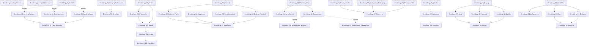

# Storygraph: 07_passages_ermittlung.tw

Quelle: `src/07_passages_ermittlung.tw`

- Passagen in dieser Datei: 42
- Verbindungen aus dieser Datei: 38
- Externe Ziele: 0
- Nicht gefundene Ziele: 0

```mermaid
flowchart TD
    classDef external fill:#302818,stroke:#c9a84c,color:#dfdcd6,stroke-dasharray: 5 5;
    classDef missing fill:#351b1b,stroke:#d98d7e,color:#f0d0c8,stroke-dasharray: 2 2;

    Ermittlung_Familia_Antwort["Ermittlung_Familia_Antwort"]
    Ermittlung_Nachspiel_Grodaus["Ermittlung_Nachspiel_Grodaus"]
    Ermittlung_S0_Auftakt["Ermittlung_S0_Auftakt"]
    Ermittlung_S0_Jarek_gemeldet["Ermittlung_S0_Jarek_gemeldet"]
    Ermittlung_S0_Jarek_schande["Ermittlung_S0_Jarek_schande"]
    Ermittlung_S0_Jarek_schweigen["Ermittlung_S0_Jarek_schweigen"]
    Ermittlung_S0_PlanFortsetzung["Ermittlung_S0_PlanFortsetzung"]
    Ermittlung_S1_Beschluss["Ermittlung_S1_Beschluss"]
    Ermittlung_S1_Intro_in_Waffenstube["Ermittlung_S1_Intro_in_Waffenstube"]
    Ermittlung_S10_Koda["Ermittlung_S10_Koda"]
    Ermittlung_S10_Rindler["Ermittlung_S10_Rindler"]
    Ermittlung_S10_Rueckblick["Ermittlung_S10_Rueckblick"]
    Ermittlung_S10_Tuersteher["Ermittlung_S10_Tuersteher"]
    Ermittlung_S10_Zugriff["Ermittlung_S10_Zugriff"]
    Ermittlung_S2_Einbruch["Ermittlung_S2_Einbruch"]
    Ermittlung_S2_Einbruch_Flucht["Ermittlung_S2_Einbruch_Flucht"]
    Ermittlung_S2_Einbruch_Versteck["Ermittlung_S2_Einbruch_Versteck"]
    Ermittlung_S2_Hauptmann["Ermittlung_S2_Hauptmann"]
    Ermittlung_S2_Verwaltungstrick["Ermittlung_S2_Verwaltungstrick"]
    Ermittlung_S3_Beobachtung["Ermittlung_S3_Beobachtung"]
    Ermittlung_S3_Beobachtung_Ausfragen["Ermittlung_S3_Beobachtung_Ausfragen"]
    Ermittlung_S3_Beobachtung_Ausspaehen["Ermittlung_S3_Beobachtung_Ausspaehen"]
    Ermittlung_S3_Erkenntnis["Ermittlung_S3_Erkenntnis"]
    Ermittlung_S4_Magister_Halm["Ermittlung_S4_Magister_Halm"]
    Ermittlung_S5_Karla_Bericht["Ermittlung_S5_Karla_Bericht"]
    Ermittlung_S5_Westhof["Ermittlung_S5_Westhof"]
    Ermittlung_S6_Beschluss["Ermittlung_S6_Beschluss"]
    Ermittlung_S6_Sackgasse["Ermittlung_S6_Sackgasse"]
    Ermittlung_S7_Erkenntnis["Ermittlung_S7_Erkenntnis"]
    Ermittlung_S7_Route_Ablaufen["Ermittlung_S7_Route_Ablaufen"]
    Ermittlung_S7_Wachposten_Befragung["Ermittlung_S7_Wachposten_Befragung"]
    Ermittlung_S7_Wachprotokolle["Ermittlung_S7_Wachprotokolle"]
    Ermittlung_S8_Karla["Ermittlung_S8_Karla"]
    Ermittlung_S8_Muster["Ermittlung_S8_Muster"]
    Ermittlung_S8_Vorwand["Ermittlung_S8_Vorwand"]
    Ermittlung_S8_Zaehlen["Ermittlung_S8_Zaehlen"]
    Ermittlung_S8_Zugang["Ermittlung_S8_Zugang"]
    Ermittlung_S9_Aufgeraeumt["Ermittlung_S9_Aufgeraeumt"]
    Ermittlung_S9_Deckung["Ermittlung_S9_Deckung"]
    Ermittlung_S9_Ergebnis["Ermittlung_S9_Ergebnis"]
    Ermittlung_S9_Nachtfuhre["Ermittlung_S9_Nachtfuhre"]
    Ermittlung_S9_Nah["Ermittlung_S9_Nah"]

    Ermittlung_S0_Auftakt -. include .-> Ermittlung_S0_Jarek_schweigen
    Ermittlung_S0_Auftakt -. include .-> Ermittlung_S0_Jarek_gemeldet
    Ermittlung_S0_Auftakt -. include .-> Ermittlung_S0_Jarek_schande
    Ermittlung_S0_Jarek_gemeldet --> Ermittlung_S0_PlanFortsetzung
    Ermittlung_S0_Jarek_schande --> Ermittlung_S0_PlanFortsetzung
    Ermittlung_S0_Jarek_schweigen --> Ermittlung_S0_PlanFortsetzung
    Ermittlung_S1_Intro_in_Waffenstube --> Ermittlung_S1_Beschluss
    Ermittlung_S2_Einbruch --> Ermittlung_S2_Einbruch_Flucht
    Ermittlung_S2_Einbruch --> Ermittlung_S2_Einbruch_Versteck
    Ermittlung_S2_Einbruch_Flucht --> Ermittlung_S3_Erkenntnis
    Ermittlung_S2_Einbruch_Versteck --> Ermittlung_S3_Erkenntnis
    Ermittlung_S2_Hauptmann --> Ermittlung_S3_Erkenntnis
    Ermittlung_S2_Verwaltungstrick --> Ermittlung_S3_Erkenntnis
    Ermittlung_S3_Beobachtung -. include .-> Ermittlung_S3_Beobachtung_Ausfragen
    Ermittlung_S3_Beobachtung -. include .-> Ermittlung_S3_Beobachtung_Ausspaehen
    Ermittlung_S4_Magister_Halm --> Ermittlung_S5_Karla_Bericht
    Ermittlung_S4_Magister_Halm --> Ermittlung_S3_Beobachtung
    Ermittlung_S5_Westhof --> Ermittlung_S6_Sackgasse
    Ermittlung_S6_Sackgasse --> Ermittlung_S6_Beschluss
    Ermittlung_S7_Route_Ablaufen --> Ermittlung_S7_Erkenntnis
    Ermittlung_S7_Wachposten_Befragung --> Ermittlung_S7_Erkenntnis
    Ermittlung_S7_Wachprotokolle --> Ermittlung_S7_Erkenntnis
    Ermittlung_S8_Karla --> Ermittlung_S8_Muster
    Ermittlung_S8_Vorwand --> Ermittlung_S8_Muster
    Ermittlung_S8_Zaehlen --> Ermittlung_S8_Muster
    Ermittlung_S8_Zugang --> Ermittlung_S8_Karla
    Ermittlung_S8_Zugang --> Ermittlung_S8_Vorwand
    Ermittlung_S8_Zugang --> Ermittlung_S8_Zaehlen
    Ermittlung_S9_Deckung --> Ermittlung_S9_Ergebnis
    Ermittlung_S9_Nachtfuhre --> Ermittlung_S9_Aufgeraeumt
    Ermittlung_S9_Nachtfuhre --> Ermittlung_S9_Nah
    Ermittlung_S9_Nachtfuhre --> Ermittlung_S9_Deckung
    Ermittlung_S9_Nah --> Ermittlung_S9_Ergebnis
    Ermittlung_S10_Koda --> Ermittlung_S10_Rueckblick
    Ermittlung_S10_Rindler --> Ermittlung_S10_Tuersteher
    Ermittlung_S10_Rindler --> Ermittlung_S10_Zugriff
    Ermittlung_S10_Tuersteher --> Ermittlung_S10_Zugriff
    Ermittlung_S10_Zugriff --> Ermittlung_S10_Koda
```

