# Storygraph: 08_passages_biwag.tw

Quelle: `src/08_passages_biwag.tw`

- Passagen in dieser Datei: 57
- Verbindungen aus dieser Datei: 76
- Externe Ziele: 1
- Nicht gefundene Ziele: 0

```mermaid
flowchart TD
    classDef external fill:#302818,stroke:#c9a84c,color:#dfdcd6,stroke-dasharray: 5 5;
    classDef missing fill:#351b1b,stroke:#d98d7e,color:#f0d0c8,stroke-dasharray: 2 2;

    Biwag_Aufbruch["Biwag_Aufbruch"]
    Biwag_Debrief["Biwag_Debrief"]
    Biwag_Debrief_Beschoenigen["Biwag_Debrief_Beschoenigen"]
    Biwag_Debrief_Ehrlich["Biwag_Debrief_Ehrlich"]
    Biwag_Drill["Biwag_Drill"]
    Biwag_Ergebnis["Biwag_Ergebnis"]
    Biwag_Loadout["Biwag_Loadout"]
    Biwag_Tag1["Biwag_Tag1"]
    Biwag_Tag1_Abend["Biwag_Tag1_Abend"]
    Biwag_Tag1_Hart["Biwag_Tag1_Hart"]
    Biwag_Tag1_Lager["Biwag_Tag1_Lager"]
    Biwag_Tag1_Schonen["Biwag_Tag1_Schonen"]
    Biwag_Tag2["Biwag_Tag2"]
    Biwag_Tag2_Fluss["Biwag_Tag2_Fluss"]
    Biwag_Tag2_Fluss_Flussbett["Biwag_Tag2_Fluss_Flussbett"]
    Biwag_Tag2_Fluss_Waldrand["Biwag_Tag2_Fluss_Waldrand"]
    Biwag_Tag2_Huegel["Biwag_Tag2_Huegel"]
    Biwag_Tag2_Huegel_Dickicht["Biwag_Tag2_Huegel_Dickicht"]
    Biwag_Tag2_Huegel_Grat["Biwag_Tag2_Huegel_Grat"]
    Biwag_Tag2_Jagd["Biwag_Tag2_Jagd"]
    Biwag_Tag2_Lager["Biwag_Tag2_Lager"]
    Biwag_Tag3["Biwag_Tag3"]
    Biwag_Tag3_Abend["Biwag_Tag3_Abend"]
    Biwag_Tag3_Enge["Biwag_Tag3_Enge"]
    Biwag_Tag3_Lager["Biwag_Tag3_Lager"]
    Biwag_Tag3_Rasten["Biwag_Tag3_Rasten"]
    Biwag_Tag3_Unterstand["Biwag_Tag3_Unterstand"]
    Biwag_Tag3_Weiterziehen["Biwag_Tag3_Weiterziehen"]
    Biwag_Tag4["Biwag_Tag4"]
    Biwag_Tag4_Abend["Biwag_Tag4_Abend"]
    Biwag_Tag4_Ansprechen["Biwag_Tag4_Ansprechen"]
    Biwag_Tag4_Hart["Biwag_Tag4_Hart"]
    Biwag_Tag4_Ignorieren["Biwag_Tag4_Ignorieren"]
    Biwag_Tag4_Jagd["Biwag_Tag4_Jagd"]
    Biwag_Tag4_Strecken["Biwag_Tag4_Strecken"]
    Biwag_Tag4_Wenzel["Biwag_Tag4_Wenzel"]
    Biwag_Tag5["Biwag_Tag5"]
    Biwag_Tag5_Abend["Biwag_Tag5_Abend"]
    Biwag_Tag5_Drill["Biwag_Tag5_Drill"]
    Biwag_Tag5_Feuer["Biwag_Tag5_Feuer"]
    Biwag_Tag5_Frueh["Biwag_Tag5_Frueh"]
    Biwag_Tag5_Reparatur["Biwag_Tag5_Reparatur"]
    Biwag_Tag5_Ruhe["Biwag_Tag5_Ruhe"]
    Biwag_Tag6["Biwag_Tag6"]
    Biwag_Tag6_Abend["Biwag_Tag6_Abend"]
    Biwag_Tag6_Desertion["Biwag_Tag6_Desertion"]
    Biwag_Tag6_Gewalt["Biwag_Tag6_Gewalt"]
    Biwag_Tag6_Lager["Biwag_Tag6_Lager"]
    Biwag_Tag6_Marsch["Biwag_Tag6_Marsch"]
    Biwag_Tag6_Verschlafen["Biwag_Tag6_Verschlafen"]
    Biwag_Tag6_Wache["Biwag_Tag6_Wache"]
    Biwag_Tag6_Ziehen["Biwag_Tag6_Ziehen"]
    Biwag_Tag6_Zurueck["Biwag_Tag6_Zurueck"]
    Biwag_Tag7["Biwag_Tag7"]
    Biwag_Tag7_Ankunft["Biwag_Tag7_Ankunft"]
    Biwag_Tag7_Forcieren["Biwag_Tag7_Forcieren"]
    Biwag_Tag7_Wuerdig["Biwag_Tag7_Wuerdig"]
    Kap2_Abend["Kap2_Abend"]

    Biwag_Aufbruch --> Biwag_Tag1
    Biwag_Debrief --> Biwag_Debrief_Ehrlich
    Biwag_Debrief --> Biwag_Debrief_Beschoenigen
    Biwag_Debrief_Beschoenigen --> Biwag_Ergebnis
    Biwag_Debrief_Ehrlich --> Biwag_Ergebnis
    Biwag_Drill --> Biwag_Loadout
    Biwag_Ergebnis --> Kap2_Abend
    Biwag_Loadout --> Biwag_Aufbruch
    Biwag_Loadout -->|goto| Biwag_Loadout
    Biwag_Tag1 --> Biwag_Tag1_Hart
    Biwag_Tag1 --> Biwag_Tag1_Schonen
    Biwag_Tag1_Abend --> Biwag_Tag2
    Biwag_Tag1_Abend -->|goto| Biwag_Tag1_Abend
    Biwag_Tag1_Hart --> Biwag_Tag1_Lager
    Biwag_Tag1_Lager -->|goto| Biwag_Tag1_Abend
    Biwag_Tag1_Schonen --> Biwag_Tag1_Lager
    Biwag_Tag2 --> Biwag_Tag2_Fluss
    Biwag_Tag2 --> Biwag_Tag2_Huegel
    Biwag_Tag2_Fluss --> Biwag_Tag2_Fluss_Flussbett
    Biwag_Tag2_Fluss --> Biwag_Tag2_Fluss_Waldrand
    Biwag_Tag2_Fluss_Flussbett --> Biwag_Tag2_Jagd
    Biwag_Tag2_Fluss_Waldrand --> Biwag_Tag2_Jagd
    Biwag_Tag2_Huegel --> Biwag_Tag2_Huegel_Dickicht
    Biwag_Tag2_Huegel --> Biwag_Tag2_Huegel_Grat
    Biwag_Tag2_Huegel_Dickicht --> Biwag_Tag2_Jagd
    Biwag_Tag2_Huegel_Grat --> Biwag_Tag2_Jagd
    Biwag_Tag2_Jagd --> Biwag_Tag2_Lager
    Biwag_Tag2_Lager --> Biwag_Tag3
    Biwag_Tag2_Lager -->|goto| Biwag_Tag2_Lager
    Biwag_Tag3 --> Biwag_Tag3_Weiterziehen
    Biwag_Tag3 --> Biwag_Tag3_Rasten
    Biwag_Tag3_Abend --> Biwag_Tag4
    Biwag_Tag3_Enge --> Biwag_Tag3_Abend
    Biwag_Tag3_Lager --> Biwag_Tag3_Unterstand
    Biwag_Tag3_Lager --> Biwag_Tag3_Enge
    Biwag_Tag3_Rasten --> Biwag_Tag3_Lager
    Biwag_Tag3_Unterstand --> Biwag_Tag3_Abend
    Biwag_Tag3_Weiterziehen --> Biwag_Tag3_Lager
    Biwag_Tag4 --> Biwag_Tag4_Jagd
    Biwag_Tag4 --> Biwag_Tag4_Strecken
    Biwag_Tag4_Abend --> Biwag_Tag5
    Biwag_Tag4_Ansprechen --> Biwag_Tag4_Abend
    Biwag_Tag4_Hart --> Biwag_Tag4_Abend
    Biwag_Tag4_Ignorieren --> Biwag_Tag4_Abend
    Biwag_Tag4_Jagd --> Biwag_Tag4_Wenzel
    Biwag_Tag4_Strecken --> Biwag_Tag4_Wenzel
    Biwag_Tag4_Wenzel --> Biwag_Tag4_Ansprechen
    Biwag_Tag4_Wenzel --> Biwag_Tag4_Hart
    Biwag_Tag4_Wenzel --> Biwag_Tag4_Ignorieren
    Biwag_Tag5 --> Biwag_Tag5_Drill
    Biwag_Tag5 --> Biwag_Tag5_Ruhe
    Biwag_Tag5_Abend --> Biwag_Tag5_Feuer
    Biwag_Tag5_Abend --> Biwag_Tag5_Frueh
    Biwag_Tag5_Drill --> Biwag_Tag5_Reparatur
    Biwag_Tag5_Feuer --> Biwag_Tag6
    Biwag_Tag5_Frueh --> Biwag_Tag6
    Biwag_Tag5_Reparatur --> Biwag_Tag5_Abend
    Biwag_Tag5_Ruhe --> Biwag_Tag5_Abend
    Biwag_Tag6 --> Biwag_Tag6_Marsch
    Biwag_Tag6_Abend --> Biwag_Tag7
    Biwag_Tag6_Desertion --> Biwag_Tag6_Zurueck
    Biwag_Tag6_Desertion --> Biwag_Tag6_Gewalt
    Biwag_Tag6_Desertion --> Biwag_Tag6_Ziehen
    Biwag_Tag6_Gewalt --> Biwag_Tag6_Abend
    Biwag_Tag6_Lager --> Biwag_Tag6_Wache
    Biwag_Tag6_Marsch --> Biwag_Tag6_Lager
    Biwag_Tag6_Verschlafen --> Biwag_Tag6_Abend
    Biwag_Tag6_Wache --> Biwag_Tag6_Desertion
    Biwag_Tag6_Wache --> Biwag_Tag6_Verschlafen
    Biwag_Tag6_Ziehen --> Biwag_Tag6_Abend
    Biwag_Tag6_Zurueck --> Biwag_Tag6_Abend
    Biwag_Tag7 --> Biwag_Tag7_Forcieren
    Biwag_Tag7 --> Biwag_Tag7_Wuerdig
    Biwag_Tag7_Ankunft --> Biwag_Debrief
    Biwag_Tag7_Forcieren --> Biwag_Tag7_Ankunft
    Biwag_Tag7_Wuerdig --> Biwag_Tag7_Ankunft
    class Kap2_Abend external;
```

## Externe Ziele

Diese Ziele liegen nicht in dieser Datei, werden aber von hier aus angesprungen.

- `Kap2_Abend` → `src/12_passages_kapitel2.tw`

