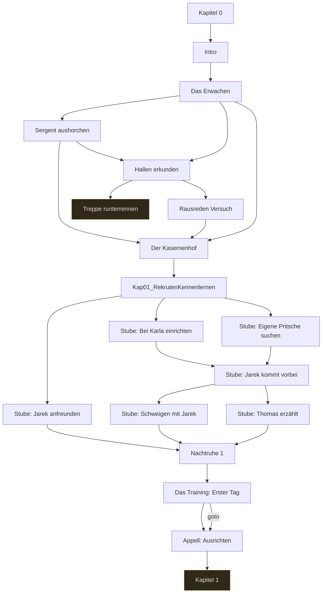

# Storygraph: 10_passages_kapitel0.tw

Quelle: `src/10_passages_kapitel0.tw`

- Passagen in dieser Datei: 17
- Verbindungen aus dieser Datei: 25
- Externe Ziele: 2
- Nicht gefundene Ziele: 0

## Externe Ziele

Diese Ziele liegen nicht in dieser Datei, werden aber von hier aus angesprungen.

- `Kapitel 1` → `src/11_passages_kapitel1.tw`
- `Treppe runterrennen` → `src/11_passages_kapitel1.tw`

