# Storygraph: 11_passages_kapitel1.tw

Quelle: `src/11_passages_kapitel1.tw`

- Passagen in dieser Datei: 50
- Verbindungen aus dieser Datei: 67
- Externe Ziele: 4
- Nicht gefundene Ziele: 0

```mermaid
flowchart TD
    classDef external fill:#302818,stroke:#c9a84c,color:#dfdcd6,stroke-dasharray: 5 5;
    classDef missing fill:#351b1b,stroke:#d98d7e,color:#f0d0c8,stroke-dasharray: 2 2;

    P_02_Sidequest_vasil["02_Sidequest_vasil"]
    P_05_Sidequest_Hansbert["05_Sidequest_Hansbert"]
    Abendappell["Abendappell"]
    Auf_Stube["Auf Stube"]
    bye["bye"]
    Der_Kasernenhof["Der Kasernenhof"]
    Event_Geschichte["Event_Geschichte"]
    Event_Geschichte_Mumpitz["Event_Geschichte_Mumpitz"]
    Event_Geschichte_Probe["Event_Geschichte_Probe"]
    Event_Schlaegerei["Event_Schlaegerei"]
    Event_Wuerfelspiel["Event_Wuerfelspiel"]
    Kap1_Der_nachste_Tag["Kap1_Der nächste Tag"]
    Kap1_Tagesstart["Kap1_Tagesstart"]
    Kapitel_1["Kapitel 1"]
    Kapitel_2["Kapitel 2"]
    Kapitel1_Ende["Kapitel1_Ende"]
    Nachmittag_Cannon["Nachmittag Cannon"]
    Nachmittag_Crossbow["Nachmittag Crossbow"]
    Nachmittag_Hub["Nachmittag Hub"]
    Nachmittag_Hub_bak["Nachmittag Hub bak"]
    Nachmittag_Medicine["Nachmittag Medicine"]
    Nachmittag_Pike["Nachmittag Pike"]
    Nachmittag_Thievery["Nachmittag Thievery"]
    Pruefung_Ergebnis["Pruefung Ergebnis"]
    Pruefung_Frage["Pruefung Frage"]
    Pruefung_Start["Pruefung Start"]
    Storry006_DrillMitSchinder["Storry006_DrillMitSchinder"]
    Story003_Abend["Story003_Abend"]
    Story003_Drill["Story003_Drill"]
    Story003_ErsterMorgen["Story003_ErsterMorgen"]
    Story003_Fruehstueck["Story003_Fruehstueck"]
    Story003_Kontakt["Story003_Kontakt"]
    Story003_Stille["Story003_Stille"]
    Story004_Interrupt_Schinder_Stellprobe["Story004_Interrupt_Schinder_Stellprobe"]
    Story005_Gottesdienst["Story005_Gottesdienst"]
    Story007_Training_mit_Karla["Story007_Training mit Karla"]
    Story008_Extra_Unterricht_Magister["Story008_Extra Unterricht Magister"]
    Studium_Aloy["Studium Aloy"]
    Studium_Archivzugang["Studium Archivzugang"]
    Studium_Diplomatie["Studium Diplomatie"]
    Studium_Disput["Studium Disput"]
    Studium_Geographie["Studium Geographie"]
    Studium_Hub["Studium Hub"]
    Studium_Magister["Studium Magister"]
    Studium_Magister_Vorstellung["Studium Magister Vorstellung"]
    Studium_Splitterlande["Studium Splitterlande"]
    Treppe_runterrennen["Treppe runterrennen"]
    Wuerfel_AllIn["Wuerfel_AllIn"]
    Wuerfel_Auswertung["Wuerfel_Auswertung"]
    Wuerfel_Set_1["Wuerfel_Set_1"]
    Wuerfel_Set_2["Wuerfel_Set_2"]
    Wuerfel_Set_5["Wuerfel_Set_5"]
    Wuerfel_Start["Wuerfel_Start"]
    Wuerfel_Zuschauen["Wuerfel_Zuschauen"]

    Kapitel_1 --> Kap1_Tagesstart
    Nachmittag_Cannon --> Abendappell
    Nachmittag_Crossbow --> Abendappell
    Nachmittag_Crossbow -->|goto| P_02_Sidequest_vasil
    Nachmittag_Hub_bak --> Nachmittag_Pike
    Nachmittag_Hub_bak --> Nachmittag_Cannon
    Nachmittag_Hub_bak --> Nachmittag_Medicine
    Nachmittag_Hub_bak --> Nachmittag_Crossbow
    Nachmittag_Hub_bak --> Nachmittag_Thievery
    Nachmittag_Medicine --> Abendappell
    Nachmittag_Pike --> Abendappell
    Nachmittag_Thievery --> Abendappell
    Studium_Archivzugang --> Studium_Hub
    Studium_Disput --> Studium_Magister
    Studium_Hub --> Studium_Aloy
    Studium_Hub --> Studium_Geographie
    Studium_Hub --> Studium_Splitterlande
    Studium_Hub --> Studium_Diplomatie
    Studium_Hub --> Studium_Magister
    Studium_Hub -->|goto| Studium_Magister_Vorstellung
    Studium_Magister --> Studium_Hub
    Studium_Magister -->|goto| Studium_Archivzugang
    Studium_Magister -->|goto| Studium_Disput
    Studium_Magister_Vorstellung --> Studium_Hub
    Pruefung_Frage -->|goto| Pruefung_Frage
    Pruefung_Frage -->|goto| Pruefung_Ergebnis
    Pruefung_Start --> Pruefung_Ergebnis
    Pruefung_Start --> Pruefung_Frage
    Story003_Drill --> Story003_Abend
    Story003_ErsterMorgen --> Story003_Fruehstueck
    Story003_Fruehstueck --> Story003_Stille
    Story003_Fruehstueck --> Story003_Kontakt
    Story003_Kontakt --> Story003_Drill
    Story003_Stille --> Story003_Drill
    Story005_Gottesdienst -->|goto| P_05_Sidequest_Hansbert
    Kapitel1_Ende --> Kapitel_2
    Treppe_runterrennen --> Der_Kasernenhof
    Wuerfel_AllIn -. include .-> Wuerfel_Auswertung
    Wuerfel_Auswertung --> Kap1_Tagesstart
    Wuerfel_Auswertung --> Wuerfel_Start
    Wuerfel_Auswertung --> Auf_Stube
    Wuerfel_Set_1 -. include .-> Wuerfel_Auswertung
    Wuerfel_Set_2 -. include .-> Wuerfel_Auswertung
    Wuerfel_Set_5 -. include .-> Wuerfel_Auswertung
    Wuerfel_Start --> Wuerfel_AllIn
    Wuerfel_Start --> Wuerfel_Set_1
    Wuerfel_Start --> Wuerfel_Set_2
    Wuerfel_Start --> Wuerfel_Set_5
    Wuerfel_Start --> Auf_Stube
    Wuerfel_Zuschauen --> Wuerfel_Start
    Wuerfel_Zuschauen --> Kap1_Tagesstart
    Event_Geschichte --> Kap1_Tagesstart
    Event_Geschichte -->|goto| Event_Geschichte_Probe
    Event_Geschichte -. include .-> Event_Geschichte_Mumpitz
    Event_Geschichte_Mumpitz --> Event_Geschichte_Probe
    Event_Geschichte_Mumpitz --> Kap1_Tagesstart
    Event_Geschichte_Probe --> Kap1_Tagesstart
    Event_Schlaegerei --> Kap1_Tagesstart
    Event_Wuerfelspiel --> Wuerfel_Start
    Event_Wuerfelspiel --> Wuerfel_Zuschauen
    Auf_Stube --> Event_Geschichte
    Auf_Stube --> Kap1_Tagesstart
    Auf_Stube -. include .-> Event_Wuerfelspiel
    Abendappell --> Auf_Stube
    Kap1_Der_nachste_Tag --> Studium_Hub
    Kap1_Der_nachste_Tag --> Nachmittag_Hub
    Kap1_Tagesstart --> Kap1_Der_nachste_Tag
    class P_02_Sidequest_vasil external;
    class P_05_Sidequest_Hansbert external;
    class Der_Kasernenhof external;
    class Kapitel_2 external;
```

## Externe Ziele

Diese Ziele liegen nicht in dieser Datei, werden aber von hier aus angesprungen.

- `02_Sidequest_vasil` → `src/20_eastereggs.tw`
- `05_Sidequest_Hansbert` → `src/20_eastereggs.tw`
- `Der Kasernenhof` → `src/10_passages_kapitel0.tw`
- `Kapitel 2` → `src/12_passages_kapitel2.tw`

