# Storygraph: 12_passages_kapitel2.tw

Quelle: `src/12_passages_kapitel2.tw`

- Passagen in dieser Datei: 45
- Verbindungen aus dieser Datei: 61
- Externe Ziele: 6
- Nicht gefundene Ziele: 0

```mermaid
flowchart TD
    classDef external fill:#302818,stroke:#c9a84c,color:#dfdcd6,stroke-dasharray: 5 5;
    classDef missing fill:#351b1b,stroke:#d98d7e,color:#f0d0c8,stroke-dasharray: 2 2;

    bye["bye"]
    Halm_S1_Ruft_Thomas["Halm_S1_Ruft_Thomas"]
    Kap2_Abend["Kap2_Abend"]
    Kap2_Abend_FruehSchlafen["Kap2_Abend_FruehSchlafen"]
    Kap2_Abend_Karla["Kap2_Abend_Karla"]
    Kap2_Abend_Karla_Reden["Kap2_Abend_Karla_Reden"]
    Kap2_Abend_Karla_Schweigen["Kap2_Abend_Karla_Schweigen"]
    Kap2_Abend_Lesen["Kap2_Abend_Lesen"]
    Kap2_Abend_Schenke["Kap2_Abend_Schenke"]
    Kap2_Abend_Waffenpflege["Kap2_Abend_Waffenpflege"]
    Kap2_Ausbildung["Kap2_Ausbildung"]
    Kap2_Die_Probe["Kap2_Die_Probe"]
    Kap2_Gattungsdrill["Kap2_Gattungsdrill"]
    Kap2_Intro["Kap2_Intro"]
    Kap2_Tageshub["Kap2_Tageshub"]
    Kap2_Tagesstart["Kap2_Tagesstart"]
    Kap2_Waffenwahl["Kap2_Waffenwahl"]
    Kap2_Waffenwahl_Reaktion["Kap2_Waffenwahl_Reaktion"]
    Kapitel_2["Kapitel 2"]
    Kapitel_2_Rekrutenhof["Kapitel 2: Rekrutenhof"]
    Karla_Geschenk["Karla_Geschenk"]
    Karla_Stufe_Reaktion["Karla_Stufe_Reaktion"]
    Karla_Zeit_Mauer["Karla_Zeit_Mauer"]
    Karla_Zeit_Stadtgang["Karla_Zeit_Stadtgang"]
    Karla_Zeit_Training["Karla_Zeit_Training"]
    Kurt_1_Reaktion["Kurt_1_Reaktion"]
    Kurt_2_Ende["Kurt_2_Ende"]
    Kurt_3_Ende["Kurt_3_Ende"]
    Kurt_Bead_1["Kurt_Bead_1"]
    Kurt_Faden_2["Kurt_Faden_2"]
    Kurt_Faden_3["Kurt_Faden_3"]
    Stadt_Arbeit["Stadt_Arbeit"]
    Stadt_Bader["Stadt_Bader"]
    Stadt_Botenstand["Stadt_Botenstand"]
    Stadt_Fuhrmannsviertel["Stadt_Fuhrmannsviertel"]
    Stadt_Geruechte["Stadt_Geruechte"]
    Stadt_Gluecksspiel["Stadt_Gluecksspiel"]
    Stadt_Kirche["Stadt_Kirche"]
    Stadt_Kirche_Ende["Stadt_Kirche_Ende"]
    Stadt_Markt["Stadt_Markt"]
    Stadt_Markt_Kauf["Stadt_Markt_Kauf"]
    Stadt_Schenke["Stadt_Schenke"]
    Stadt_Trinken["Stadt_Trinken"]
    Suspicion_Rapport_Ausrede["Suspicion_Rapport_Ausrede"]
    Suspicion_Rapport_Ehrlich["Suspicion_Rapport_Ehrlich"]
    Suspicion_Rapport_Rindler["Suspicion_Rapport_Rindler"]
    Suspicion_Spinddurchsuchung["Suspicion_Spinddurchsuchung"]
    Tageshub_Halm["Tageshub_Halm"]
    Tageshub_Karla["Tageshub_Karla"]
    Tageshub_Rindler["Tageshub_Rindler"]
    Tageshub_Stadt["Tageshub_Stadt"]

    Kap2_Abend --> Kap2_Abend_FruehSchlafen
    Kap2_Abend --> Kap2_Tagesstart
    Kap2_Abend_FruehSchlafen --> Kap2_Tagesstart
    Kap2_Abend_Karla --> Kap2_Abend_Karla_Schweigen
    Kap2_Abend_Karla --> Kap2_Abend_Karla_Reden
    Kap2_Abend_Karla_Reden --> Kap2_Abend
    Kap2_Abend_Karla_Schweigen --> Kap2_Abend
    Kap2_Abend_Lesen --> Kap2_Abend
    Kap2_Abend_Schenke --> Stadt_Schenke
    Kap2_Abend_Waffenpflege --> Kap2_Abend
    Kap2_Ausbildung --> Kap2_Tagesstart
    Kap2_Die_Probe --> Kapitel_2_Rekrutenhof
    Kap2_Gattungsdrill --> Kap2_Tageshub
    Kap2_Intro --> Kap2_Die_Probe
    Kap2_Tageshub --> Kap2_Abend
    Kap2_Tageshub -->|goto| Kap2_Abend
    Kap2_Tageshub --> Kap2_Tagesstart
    Kap2_Tagesstart --> Kap2_Tageshub
    Kap2_Waffenwahl -->|goto| Kap2_Waffenwahl_Reaktion
    Kap2_Waffenwahl_Reaktion --> Kap2_Ausbildung
    Kapitel_2 --> bye
    Kapitel_2_Rekrutenhof --> Kap2_Waffenwahl
    Stadt_Arbeit --> Tageshub_Stadt
    Stadt_Bader --> Tageshub_Stadt
    Stadt_Botenstand --> Tageshub_Stadt
    Stadt_Botenstand -->|goto| Tageshub_Stadt
    Stadt_Fuhrmannsviertel --> Tageshub_Stadt
    Stadt_Geruechte --> Tageshub_Stadt
    Stadt_Gluecksspiel --> Stadt_Gluecksspiel
    Stadt_Gluecksspiel --> Stadt_Schenke
    Stadt_Kirche --> Tageshub_Stadt
    Stadt_Kirche -->|goto| Stadt_Kirche_Ende
    Stadt_Kirche_Ende --> Tageshub_Stadt
    Stadt_Markt --> Tageshub_Stadt
    Stadt_Markt -->|goto| Stadt_Markt
    Stadt_Markt_Kauf --> Stadt_Markt
    Stadt_Schenke --> Stadt_Gluecksspiel
    Stadt_Schenke --> Stadt_Trinken
    Stadt_Trinken --> Stadt_Schenke
    Suspicion_Rapport_Rindler --> Suspicion_Rapport_Ehrlich
    Suspicion_Rapport_Rindler --> Suspicion_Rapport_Ausrede
    Tageshub_Halm --> Kap2_Tageshub
    Tageshub_Karla --> Karla_Zeit_Training
    Tageshub_Karla --> Karla_Zeit_Mauer
    Tageshub_Karla --> Karla_Zeit_Stadtgang
    Tageshub_Karla --> Karla_Geschenk
    Tageshub_Karla --> Kap2_Tageshub
    Tageshub_Karla -->|goto| Karla_Stufe_Reaktion
    Tageshub_Rindler --> Kap2_Tageshub
    Tageshub_Stadt -->|goto| Stadt_Markt
    Tageshub_Stadt -->|goto| Stadt_Arbeit
    Tageshub_Stadt -->|goto| Stadt_Schenke
    Tageshub_Stadt -->|goto| Stadt_Geruechte
    Tageshub_Stadt -->|goto| Stadt_Bader
    Tageshub_Stadt -->|goto| Stadt_Kirche
    Tageshub_Stadt -->|goto| Stadt_Fuhrmannsviertel
    Tageshub_Stadt -->|goto| Stadt_Botenstand
    Tageshub_Stadt -->|goto| Kap2_Tageshub
    Kurt_Bead_1 -->|goto| Kurt_1_Reaktion
    Kurt_Faden_2 --> Kurt_2_Ende
    Kurt_Faden_3 -->|goto| Kurt_3_Ende
    class bye external;
    class Karla_Geschenk external;
    class Karla_Stufe_Reaktion external;
    class Karla_Zeit_Mauer external;
    class Karla_Zeit_Stadtgang external;
    class Karla_Zeit_Training external;
```

## Externe Ziele

Diese Ziele liegen nicht in dieser Datei, werden aber von hier aus angesprungen.

- `bye` → `src/11_passages_kapitel1.tw`
- `Karla_Geschenk` → `src/05_passages_karla.tw`
- `Karla_Stufe_Reaktion` → `src/05_passages_karla.tw`
- `Karla_Zeit_Mauer` → `src/05_passages_karla.tw`
- `Karla_Zeit_Stadtgang` → `src/05_passages_karla.tw`
- `Karla_Zeit_Training` → `src/05_passages_karla.tw`

