# Storygraph: 20_eastereggs.tw

Quelle: `src/20_eastereggs.tw`

- Passagen in dieser Datei: 41
- Verbindungen aus dieser Datei: 54
- Externe Ziele: 6
- Nicht gefundene Ziele: 0

```mermaid
flowchart TD
    classDef external fill:#302818,stroke:#c9a84c,color:#dfdcd6,stroke-dasharray: 5 5;
    classDef missing fill:#351b1b,stroke:#d98d7e,color:#f0d0c8,stroke-dasharray: 2 2;

    P_02_Sidequest_vasil["02_Sidequest_vasil"]
    P_02_Sidequest_vasil_Ablehnung["02_Sidequest_vasil_Ablehnung"]
    P_02_Sidequest_vasil_finalize["02_Sidequest_vasil_finalize"]
    P_02_Sidequest_vasil_Hoeflich["02_Sidequest_vasil_Hoeflich"]
    P_02_Sidequest_vasil_Lachen["02_Sidequest_vasil_Lachen"]
    P_02_Sidequest_vasil_Tipp["02_Sidequest_vasil_Tipp"]
    P_02_Sidequest_vasil_Zusehen["02_Sidequest_vasil_Zusehen"]
    P_03_Sidequest_wenzel["03_Sidequest_wenzel"]
    P_03_Sidequest_wenzel_Auftrag["03_Sidequest_wenzel_Auftrag"]
    P_03_Sidequest_wenzel_finalize["03_Sidequest_wenzel_finalize"]
    P_03_Sidequest_wenzel_Fragen["03_Sidequest_wenzel_Fragen"]
    P_03_Sidequest_wenzel_Mitspielen["03_Sidequest_wenzel_Mitspielen"]
    P_03_Sidequest_wenzel_Warnen["03_Sidequest_wenzel_Warnen"]
    P_04_Sidequest_diplomaten["04_Sidequest_diplomaten"]
    P_04_Sidequest_diplomaten_Auftrag["04_Sidequest_diplomaten_Auftrag"]
    P_04_Sidequest_diplomaten_Eintreten["04_Sidequest_diplomaten_Eintreten"]
    P_04_Sidequest_diplomaten_Erwischt["04_Sidequest_diplomaten_Erwischt"]
    P_04_Sidequest_diplomaten_finalize["04_Sidequest_diplomaten_finalize"]
    P_04_Sidequest_diplomaten_Kurt["04_Sidequest_diplomaten_Kurt"]
    P_04_Sidequest_diplomaten_Lauschen["04_Sidequest_diplomaten_Lauschen"]
    P_04_Sidequest_diplomaten_Magd["04_Sidequest_diplomaten_Magd"]
    P_05_Sidequest_Hansbert["05_Sidequest_Hansbert"]
    P_05_Sidequest_Hansbert_Abbruch["05_Sidequest_Hansbert_Abbruch"]
    P_05_Sidequest_Hansbert_Barsinger["05_Sidequest_Hansbert_Barsinger"]
    P_05_Sidequest_Hansbert_finalize["05_Sidequest_Hansbert_finalize"]
    P_05_Sidequest_Hansbert_Hinsetzen["05_Sidequest_Hansbert_Hinsetzen"]
    Abendappell["Abendappell"]
    Auf_Stube["Auf Stube"]
    EE_Tross["EE_Tross"]
    EE_Tross_Abgang["EE_Tross_Abgang"]
    EE_Tross_Adresse["EE_Tross_Adresse"]
    EE_Tross_Ehrlich["EE_Tross_Ehrlich"]
    EE_Tross_Intro["EE_Tross_Intro"]
    EE_Tross_Rosi["EE_Tross_Rosi"]
    Hansbert_Frech["Hansbert_Frech"]
    Hansbert_Hoeflich["Hansbert_Hoeflich"]
    Hansbert_Neugierig["Hansbert_Neugierig"]
    Nachmittag_Crossbow["Nachmittag Crossbow"]
    Nachmittag_Hub["Nachmittag Hub"]
    Story002_Bier_Ausgeben["Story002_Bier_Ausgeben"]
    Story002_BierAnnehmen["Story002_BierAnnehmen"]
    Story002_finalize["Story002_finalize"]
    Story002_Taverne_Ansprechen_KeinAufhaenger["Story002_Taverne_Ansprechen_KeinAufhaenger"]
    Story002_Taverne_Ansprechen_MitAufhaenger["Story002_Taverne_Ansprechen_MitAufhaenger"]
    Story002_Taverne_mit_Lars_Und_Hadde["Story002_Taverne_mit_Lars_Und_Hadde"]
    Story005_Gottesdienst["Story005_Gottesdienst"]
    Studium_Hub["Studium Hub"]

    P_05_Sidequest_Hansbert --> P_05_Sidequest_Hansbert_Abbruch
    P_05_Sidequest_Hansbert --> P_05_Sidequest_Hansbert_Hinsetzen
    P_05_Sidequest_Hansbert_Abbruch --> Story005_Gottesdienst
    P_05_Sidequest_Hansbert_Barsinger -. include .-> P_05_Sidequest_Hansbert_finalize
    P_05_Sidequest_Hansbert_Hinsetzen --> Hansbert_Hoeflich
    P_05_Sidequest_Hansbert_Hinsetzen --> Hansbert_Neugierig
    P_05_Sidequest_Hansbert_Hinsetzen --> Hansbert_Frech
    P_05_Sidequest_Hansbert_finalize --> Nachmittag_Hub
    Hansbert_Frech --> P_05_Sidequest_Hansbert_Barsinger
    Hansbert_Hoeflich --> P_05_Sidequest_Hansbert_Barsinger
    Hansbert_Neugierig --> P_05_Sidequest_Hansbert_Barsinger
    P_04_Sidequest_diplomaten -->|goto| P_04_Sidequest_diplomaten_Eintreten
    P_04_Sidequest_diplomaten -->|goto| P_04_Sidequest_diplomaten_Erwischt
    P_04_Sidequest_diplomaten -->|goto| P_04_Sidequest_diplomaten_Lauschen
    P_04_Sidequest_diplomaten -->|goto| P_04_Sidequest_diplomaten_Magd
    P_04_Sidequest_diplomaten_Auftrag --> P_04_Sidequest_diplomaten
    P_04_Sidequest_diplomaten_Eintreten -. include .-> P_04_Sidequest_diplomaten_finalize
    P_04_Sidequest_diplomaten_Erwischt --> P_04_Sidequest_diplomaten_Kurt
    P_04_Sidequest_diplomaten_Kurt --> Auf_Stube
    P_04_Sidequest_diplomaten_Lauschen --> P_04_Sidequest_diplomaten_Eintreten
    P_04_Sidequest_diplomaten_Magd -. include .-> P_04_Sidequest_diplomaten_finalize
    P_04_Sidequest_diplomaten_finalize --> Studium_Hub
    P_03_Sidequest_wenzel --> P_03_Sidequest_wenzel_Mitspielen
    P_03_Sidequest_wenzel --> P_03_Sidequest_wenzel_Warnen
    P_03_Sidequest_wenzel --> P_03_Sidequest_wenzel_Fragen
    P_03_Sidequest_wenzel_Auftrag --> P_03_Sidequest_wenzel
    P_03_Sidequest_wenzel_Fragen -. include .-> P_03_Sidequest_wenzel_finalize
    P_03_Sidequest_wenzel_Mitspielen -. include .-> P_03_Sidequest_wenzel_finalize
    P_03_Sidequest_wenzel_Warnen -. include .-> P_03_Sidequest_wenzel_finalize
    P_03_Sidequest_wenzel_finalize --> Abendappell
    P_02_Sidequest_vasil --> P_02_Sidequest_vasil_Tipp
    P_02_Sidequest_vasil --> P_02_Sidequest_vasil_Zusehen
    P_02_Sidequest_vasil --> P_02_Sidequest_vasil_Ablehnung
    P_02_Sidequest_vasil_Ablehnung -. include .-> P_02_Sidequest_vasil_finalize
    P_02_Sidequest_vasil_Hoeflich -. include .-> P_02_Sidequest_vasil_finalize
    P_02_Sidequest_vasil_Lachen -. include .-> P_02_Sidequest_vasil_finalize
    P_02_Sidequest_vasil_Tipp --> P_02_Sidequest_vasil_Lachen
    P_02_Sidequest_vasil_Tipp --> P_02_Sidequest_vasil_Hoeflich
    P_02_Sidequest_vasil_Zusehen -. include .-> P_02_Sidequest_vasil_finalize
    P_02_Sidequest_vasil_finalize --> Nachmittag_Crossbow
    Story002_BierAnnehmen --> Story002_finalize
    Story002_Bier_Ausgeben --> Story002_finalize
    Story002_Taverne_Ansprechen_KeinAufhaenger --> Story002_Bier_Ausgeben
    Story002_Taverne_Ansprechen_KeinAufhaenger --> Auf_Stube
    Story002_Taverne_Ansprechen_MitAufhaenger --> Story002_BierAnnehmen
    Story002_Taverne_mit_Lars_Und_Hadde --> Story002_Taverne_Ansprechen_MitAufhaenger
    Story002_Taverne_mit_Lars_Und_Hadde --> Auf_Stube
    Story002_Taverne_mit_Lars_Und_Hadde --> Story002_Taverne_Ansprechen_KeinAufhaenger
    EE_Tross --> EE_Tross_Adresse
    EE_Tross --> EE_Tross_Ehrlich
    EE_Tross_Adresse --> EE_Tross_Rosi
    EE_Tross_Ehrlich --> EE_Tross_Rosi
    EE_Tross_Intro --> EE_Tross
    EE_Tross_Rosi --> EE_Tross_Abgang
    class Abendappell external;
    class Auf_Stube external;
    class Nachmittag_Crossbow external;
    class Nachmittag_Hub external;
    class Story005_Gottesdienst external;
    class Studium_Hub external;
```

## Externe Ziele

Diese Ziele liegen nicht in dieser Datei, werden aber von hier aus angesprungen.

- `Abendappell` → `src/11_passages_kapitel1.tw`
- `Auf Stube` → `src/11_passages_kapitel1.tw`
- `Nachmittag Crossbow` → `src/11_passages_kapitel1.tw`
- `Nachmittag Hub` → `src/11_passages_kapitel1.tw`
- `Story005_Gottesdienst` → `src/11_passages_kapitel1.tw`
- `Studium Hub` → `src/11_passages_kapitel1.tw`

