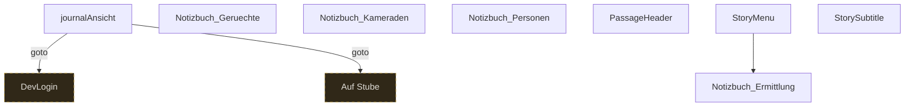

# Storygraph: 70_header_und_journal.tw

Quelle: `src/70_header_und_journal.tw`

- Passagen in dieser Datei: 8
- Verbindungen aus dieser Datei: 3
- Externe Ziele: 2
- Nicht gefundene Ziele: 0

## Externe Ziele

Diese Ziele liegen nicht in dieser Datei, werden aber von hier aus angesprungen.

- `Auf Stube` → `src/11_passages_kapitel1.tw`
- `DevLogin` → `src/80_debugger.tw`

