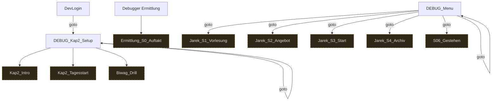

# Storygraph: 80_debugger.tw

Quelle: `src/80_debugger.tw`

- Passagen in dieser Datei: 4
- Verbindungen aus dieser Datei: 12
- Externe Ziele: 9
- Nicht gefundene Ziele: 0

## Externe Ziele

Diese Ziele liegen nicht in dieser Datei, werden aber von hier aus angesprungen.

- `Biwag_Drill` → `src/08_passages_biwag.tw`
- `Ermittlung_S0_Auftakt` → `src/07_passages_ermittlung.tw`
- `Jarek_S1_Vorlesung` → `src/06_passages_jarek.tw`
- `Jarek_S2_Angebot` → `src/06_passages_jarek.tw`
- `Jarek_S3_Start` → `src/06_passages_jarek.tw`
- `Jarek_S4_Archiv` → `src/06_passages_jarek.tw`
- `Kap2_Intro` → `src/12_passages_kapitel2.tw`
- `Kap2_Tagesstart` → `src/12_passages_kapitel2.tw`
- `S06_Gestehen` → `src/06_passages_jarek.tw`

